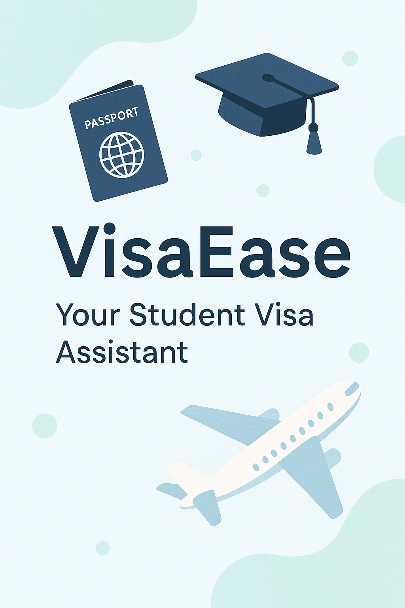

# VisaEase 🎓✈️

VisaEase is a Custom GPT I created to help international students easily understand U.S. immigration processes such as F-1 Visa, OPT, CPT, and STEM OPT.

## 🌟 Features
- Explains F-1, OPT, CPT, and STEM OPT rules in plain English
- Provides deadlines and document checklists
- Suggests email templates to contact DSOs and employers
- Friendly, supportive tone — like a helpful upperclassman
- Designed for clarity, accuracy, and peace of mind

## 🔗 Try it Live
👉 [Click here to use VisaEase on ChatGPT](https://chatgpt.com/g/g-6831efe74b9881918922b6fbf6f9d873-visaease)  
*(Requires ChatGPT Plus)*

## 👨‍🎓 Why I Built It
As an international graduate student, I realized how stressful and unclear visa processes can be. So I built VisaEase to make life a little easier for others going through the same journey.

## 📷 Poster

## 🛠️ Tech Stack
- OpenAI Custom GPTs
- Reverse prompt engineering
- Content design for non-technical users

## 💡 Future Ideas
- Document upload & form analysis
- Country-specific rules (Canada, UK, etc.)
- Email alert for key immigration deadlines

---
